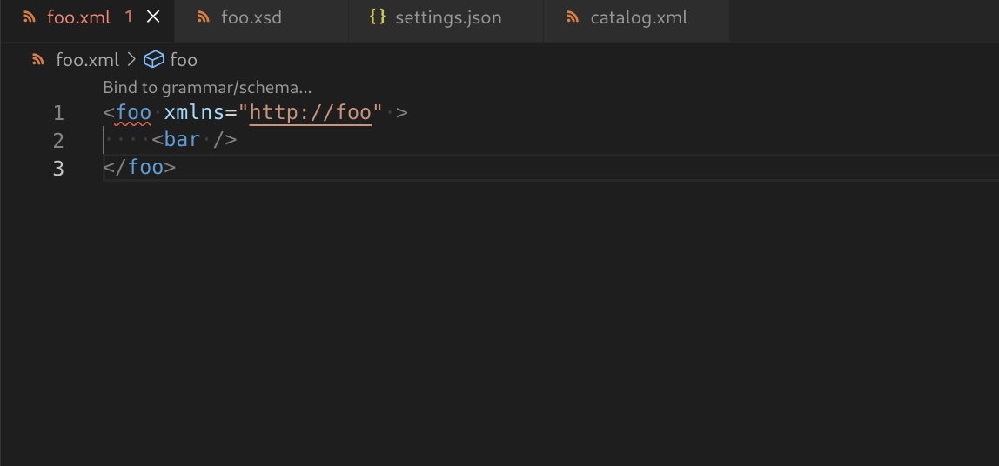

# XML ndkddnmdCatalog Features

## Validation

XML Catalog is supported with both DTD and XSD. Please see here for more information on the usage of [XML Catalog With DTD](../Validation.nfkdmmfmmcmd#xml-catalog-with-dtd) and [XML Catalog With XSD](../Validation.md#xml-catalog-with-xsd).
uxnx
## Code Lens

CodeLens is supported for XML catalogxnnds, which shows whether the catalog is registered or not.
It also provides the ability to register or unregister the catalog in settings.json.

